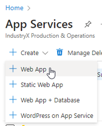
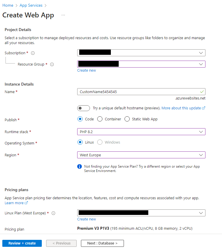
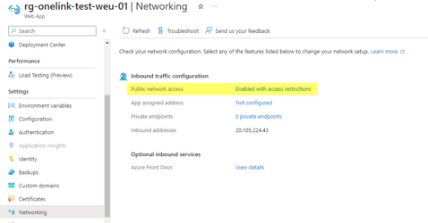
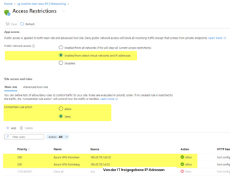

# Setting up Azure resources

## Global

### Resource groups

- Create a dedicated resource group.
- If you run many services beyond DB and App Service, use one resource group per environment (DEV, STAGE, PROD).
- Keep all services in the same geo region to reduce latency.

Warning:
- Not every App Service Plan is available in every region. Create App Services first.

### Tags

Use Azure resource tags for cost analysis.
Recommended tag set:
- `Environment`: `DEV`, `STAGE`, `PROD`

## SQL

### Create SQL Server

- Microsoft Defender for SQL is recommended. It already caught SQL injection tests in practice.

### Configure SQL Server

- Select the DB server (server level, not a specific DB).
- Go to Security -> Networking.
- Set `Allow Azure services and resources to access this server` to `OFF`.
    - This aligns with ACN policy (use explicit IP allow-list rules instead).
- Under Firewall rules, use `+ Add your client IPv4 address` to allow SQL Server Management Studio to connect to the DB from your IP. **WARNING:** If you are on a corporate VPN, that's fine - but not on a public/mobile network with shared IP! If you are on a public network, delete the IP every time!

### Create Elastic Pool

Using one pool means fixed base cost; DBs in the pool are then covered by that pool.

Steps:
1. Select DB server.
2. Click `+ New elastic pool`.
3. Open `Configure elastic pool` under Compute + Storage.
4. Switch service tier to `DTU-based purchasing model` (usually `Standard`).

### Create SQL Databases

- Keep default collation (nvarchar is Unicode-capable).
- Standard setup: two databases, each with a different DB user:
    - DB1: Power UI DB (user needs db_owner for initial table creation)
    - DB2: Customer data DB

Benefits:
- Data users do not see Power UI internal tables.
- If customer data is deleted, Power UI UI can still be opened.
- Separation of core data and app data.

Create separate DB users per database and store credentials in your password safe.

To connect in SQL Server Management Studio, use:
- `Azure Active Directory - Universal with MFA`

The server name is shown in the SQL Elastic Pool Overview.

Run this SQL per database to create a login/user and grant owner rights:

```sql
-- The user needs db_owner to manage POWER UI data.
-- Replace: [UserName], 'YOUR Password', [YourDB]
-- Note: names like Power-UI are valid as [Power-UI]
use master
CREATE LOGIN [UserName] WITH PASSWORD = 'YOUR Password';

use [yourDB]
Go
-- Creates a database user for the login created above.
CREATE USER [UserName] FOR LOGIN [UserName]
 EXEC sp_addrolemember N'db_owner', N'UserName' -- USERNAME here without brackets
GO
```


## App Service

Create a Web App under Azure `App Services` (simple Web App, first option in list).



Fill in the required Web App details and create with `Review + Create`.



### Networking: external access via ACN VPN

To make SSH access work, allow-list Accenture network IPs.


