# Installation on Azure AppService

Power UI can be installed on Microsoft Azure and operated at relatively low cost.

## Azure Sizing

Example architecture for a small Power UI setup with a separate database for the customer app:

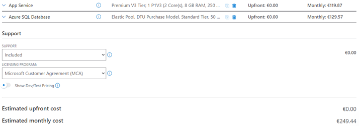

For App Service, use a Linux server with PHP 8.0+.
Recommended plan:
- 2 CPU cores
- At least 4 GB RAM

For the database layer, the most cost-effective option is typically one Elastic Pool containing both:
- Power UI database
- Customer app database


## Preparation for Installation

### Installation via SSH (without FTP)

#### Download via SSH

You can download and run the self-update package (`.phx`) directly over SSH.
This also works on a clean App Service if DB connection and host config are correct.

```bash
curl https://<yourdomain.com>/devman/api/proxy/ota/<projekt_alias>/<host_uid> --header "Authorization: Basic <Base64(user:passwort)>" --output install.phx
php -d memory_limit=2G install.phx
```

The authorization header can be generated in DevMan under:
- `Administration > Proxy routes`

#### Copy text file content over Azure SSH

You can create/edit a remote file and paste local content into it.

1. Open file: `nano <filename>`
2. Move cursor to start of file.
3. Set marker: `Ctrl+6`
4. Cut from marker to end: `Alt+Shift+T` (alternatives: `Alt+T` or `Ctrl+K`)
5. Move cursor back to start.
6. Paste via `Right click > Paste` and wait until content appears (can take up to ~1 minute)
7. If pasted text remains selected, deselect with `Ctrl+6`
8. Save with `Ctrl+X` + `Enter` (if asked about clipboard save, answer `N`)

### Installation via FTP

#### Configure FTP connection

Prerequisites in Azure App Service Configuration:
- `FTP Basic Auth Publishing Credentials`: `On`
- `FTP state`: `FTPS only`

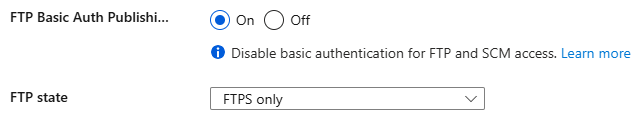

Steps:
1. Azure Portal -> App Service -> `Deployment Center` -> `FTPS credentials`
2. Under `User Scope`, set username/password
3. Login format: `{AppServiceName}\{Username}` + password
4. Configure FTP client (for example FileZilla) with host from FTPS credentials
5. Disable VPN
6. Connect

Important:
- By current Accenture security rules, SFTP on App Services must not stay enabled permanently.
- Enable briefly under `Configuration > General settings > FTP state` (`SFTP only`) and then disable again.

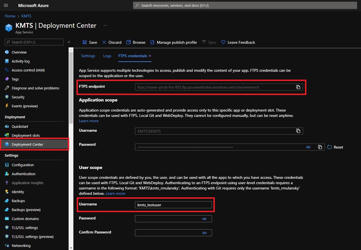

#### Total Commander

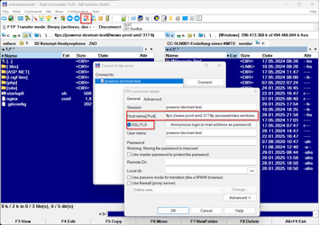

#### FileZilla

FileZilla is currently blocked by Accenture as a security risk.

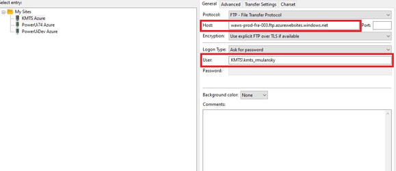

## Startup Script and NGINX Config

For PHP 8 Linux Azure hosting, configure a startup script that on every restart:
- installs/reloads correct NGINX config
- installs/starts CRON
- registers scheduler cron job

Required files:
- `startup8.sh`
- `nginx.conf`
- additionally `nginx_http.conf`

Deploy files to App Service `/home` and INI files to `/home/php/ini`.

### NGINX configs

Create `nginx.conf` (adjust `root` path and server name/body size values as needed):

```nginx
server {
	#proxy_cache cache;
	#proxy_cache_valid 200 1s;
	listen 8080;
	listen [::]:8080;
	root /home/site/wwwroot/powerui/current;
	index  index.php index.html index.htm;
	server_name [SERVER_NAME].azurewebsites.net;
	client_max_body_size 100M;

	location / {
		if (!-e $request_filename){
			rewrite ^/api/.*$ /vendor/exface/core/index.php;
		}

		if ($request_uri ~ "^$"){
			rewrite ^/$ /$request_uri redirect;
		}

		rewrite ^/?$ /vendor/exface/core/index.php;

		if (!-e $request_filename){
			rewrite ^/[^/]*$ /vendor/exface/core/index.php;
		}
	}

	location /config {
		return 403;
	}

	location /backup {
		return 403;
	}

	location /translations {
		return 403;
	}

	location /logs {
		return 403;
	}

	location ~ ^/data/\..*$ {
		return 403;
	}

	location ~ /\.git {
		deny all;
		access_log off;
		log_not_found off;
	}

	location ~ [^/]\.php(/|$) {
		if ($request_uri !~ "^/vendor/exface/core/index\.php$") {
			rewrite ^/api/.*$ /vendor/exface/core/index.php;
		}
		fastcgi_split_path_info ^(.+?\.php)(|/.*)$;
		fastcgi_pass 127.0.0.1:9000;
		include fastcgi_params;
		fastcgi_param HTTP_PROXY "";
		fastcgi_param SCRIPT_FILENAME $document_root$fastcgi_script_name;
		fastcgi_param PATH_INFO $fastcgi_path_info;
		fastcgi_param QUERY_STRING $query_string;
		fastcgi_intercept_errors on;
		fastcgi_connect_timeout         300;
		fastcgi_send_timeout           3600;
		fastcgi_read_timeout           3600;
		fastcgi_buffer_size 128k;
		fastcgi_buffers 4 256k;
		fastcgi_busy_buffers_size 256k;
		fastcgi_temp_file_write_size 256k;
	}
}
```

Create `nginx_http.conf`:

```nginx
client_header_buffer_size 5120k;
large_client_header_buffers 16 5120k;
```

### startup8.sh

Create `startup8.sh` and adapt the Power UI action path if needed:

```bash
apt-get update -qq --allow-releaseinfo-change
apt-get install unzip -yqq
cp /home/nginx.conf /etc/nginx/sites-available/default
cp /home/nginx_http.conf /etc/nginx/conf.d/nginx_http.conf
service nginx reload
cp /home/ini/* /usr/local/etc/php/conf.d
cp /home/php_fpm/* /usr/local/etc/php-fpm.d

apt-get install cron -yqq
service cron start

apt-get install git -yqq
service git start
cp /home/.gitconfig /var/www/.gitconfig

(crontab -l 2>/dev/null; echo "*/15 * * * * /usr/local/bin/php /home/site/wwwroot/powerui/current/vendor/bin/action exface.Core:RunScheduler 2>&1")|crontab
```

### Enable startup command

Upload both files to `/home/php` via FTP.

Then in Azure Portal set:
- `Configuration -> Stack settings -> Startup command`
- Value: `/home/startup8.sh`

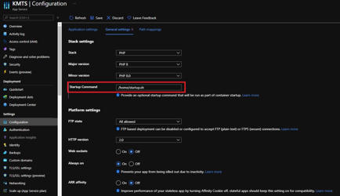

## Install APCu Cache

APCu is used to reduce filesystem access.

Reference guide:
- https://azureossd.github.io/2021/10/21/php-install-apcu/index.html

Use App Service SSH and run commands line-by-line.

### Build APCu extension manually

```bash
mkdir -p /tmp/pear/temp
cd /tmp/pear/temp
```

```bash
pecl bundle apcu
cd apcu
phpize
./configure
make
```

```bash
mkdir -p /home/php/ext
cp /tmp/pear/temp/apcu/modules/apcu.so /home/php/ext
```

```bash
mkdir -p /home/php/ini
echo "extension=/home/php/ext/apcu.so" > /home/php/ini/z_apcu.ini
```

Set App Setting:
- Name: `PHP_INI_SCAN_DIR`
- Value: `/usr/local/etc/php/conf.d:/home/php/ini`

Save changes and restart App Service.

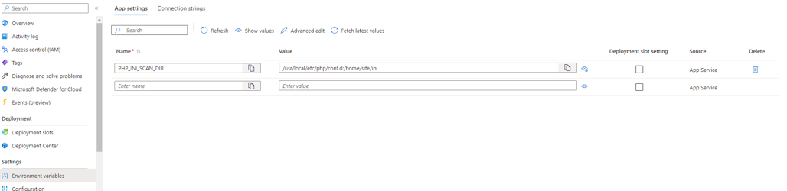

Verify:

```bash
php -i | grep apc
```

## Configure SQL Server Connectivity from App Service

In SQL Server `Networking`:
- Disable `Allow Azure services ...` (per ACN policy)
- Add all outbound App Service networking IPs manually

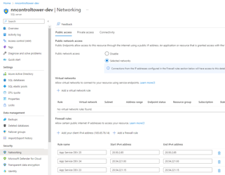
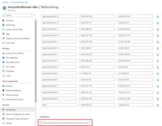
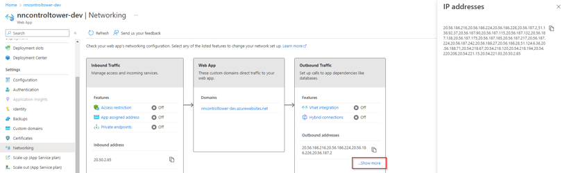

## Deploy Power UI

### First install via Build Server (SelfUpdate)

Recommended flow:
1. Create new host (and project if required) in build server.
2. Start build.
3. Configure DevMan proxy route so Azure can access internal build server.
4. Run `Deploy` in build server for that host.
5. In App Service SSH:

```bash
cd /home/site/wwwroot
mkdir powerui
cd powerui
wget -d --header="Authorization: Basic ZGV...E1NDE=" https://powerui.salt-solutions.de/devman/api/proxy/ota/salt_azure/0x11ef8104e8e1d2688104005056be9857
```

Replace in URL/header:
- Basic auth header from DevMan `Administration > Proxy Routes` (`HTTP Basic auth header` button)
- `salt_azure/0x...` with project alias and host UID

Run installer:

```bash
php -d memory_limit=2G 0x11ef8104e8e1d2688104005056be9857
```

### Updates via Build Server (SelfUpdate)

If Power UI is already running, use deployer recipe:
- `Self-extractor + Updater pull`

### First install/update via manual upload (alternative)

1. Create FTP credentials.
2. Build package on build server and deploy as USBSelfExtractor.
3. Download self-deployment file and zip it (for example `powerui.zip`).
4. Upload zip to Kudu zip API:

```bash
curl -v -X POST -u {Username}:{Password} https://{AppServiceName}.scm.azurewebsites.net/api/zip/site/wwwroot -T {Path to zip file}
```

5. Wait for upload completion.
   Successful upload output example:

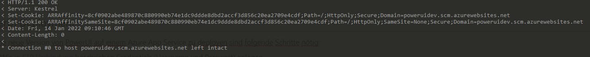

6. Open App Service SSH.
7. Run deployment command:

```bash
php -d memory_limit=2G site/wwwroot/{SelfDeployment-Filename}
# Example:
php -d memory_limit=2G site/wwwroot/beta-0.8+20220113144223_Azure_Test_PHP_80.phx
```

8. Wait for completion.
9. On first run, execute deployment a second time if folder permissions cause issues.

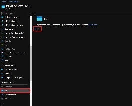
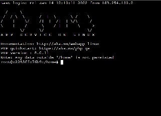

## Deploy Customer Apps

### Via Git

Recommended approach:
- Connect App Service as Git client to your repos.
- Pull updates and run Repair.
- Azure-side changes can be committed back to Git if needed.

### Manual (legacy)

1. Configure FTP credentials.
2. Download app zip or copy app folder locally.
3. Rename app folder correctly and zip it (for example `app.zip`).
4. Open App Service SSH.
5. Remove current app folder from active release:

```bash
rm -r site/wwwroot/powerui/current/vendor/{Vendor-Path}/{App-Path}
# Example:
rm -r site/wwwroot/powerui/current/vendor/example/app
```

6. Upload new app zip from local machine:

```bash
curl -v -X POST -u {Username}:{Password} https://example.scm.azurewebsites.net/api/zip/site/wwwroot/powerui/current/vendor/{Vendor-Path} -T {Path to zip file}
```

Example:

```bash
curl -v -X PUT -u {username}:{password} https://example.scm.azurewebsites.net/api/zip/site/wwwroot/powerui/current/vendor/example -T C:\Deploy\app.zip
```

7. Wait for upload completion.
8. In Power UI, run `Repair` for the app.

## Azure SQL Database Backups

### View and edit backup policies

1. Open the SQL Server that hosts your database.
2. Open `Backups`.

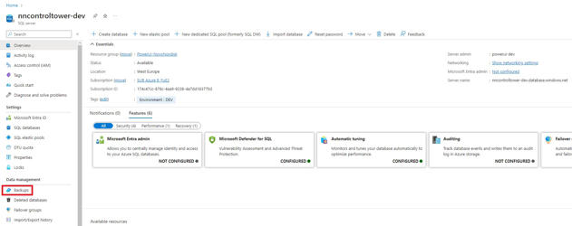

3. Review `Available Backups` and `Retention Policies`.
4. Under `Retention Policies`, configure backup frequency.
5. Use `Point-in-time Restore` to restore to an exact timestamp.

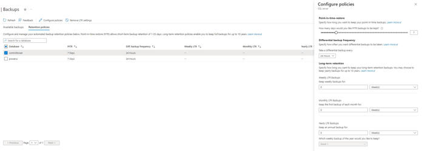

### Restore SQL backup

1. In `Available Backups`, click `Restore`.

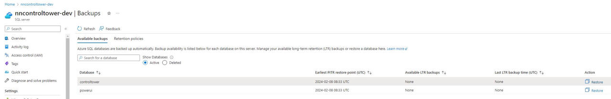

2. Select:
   - `Restore Point (UTC)`
   - target DB name
   - restore source (`Point-In-Time` or `Long-Term`)

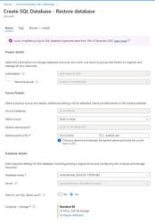

3. After Azure creates the restored DB, update Power UI `Connection` to point to the restored DB.

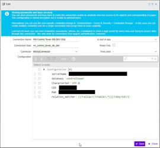

## Azure Web App Backups

### View and edit backup policies

1. Open the target Web App.
2. Open `Backups`.

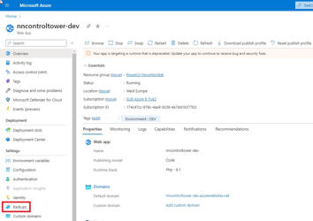

3. Review available backups.
4. Under `Configure custom backups`, define custom `Backup schedules`.

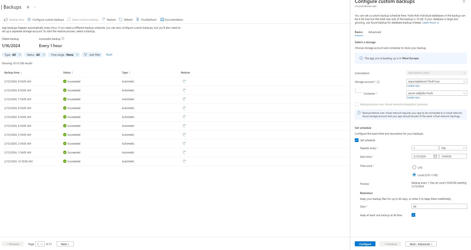

### Restore Web App backup (currently not possible)

1. Click restore arrow icon on an available backup.

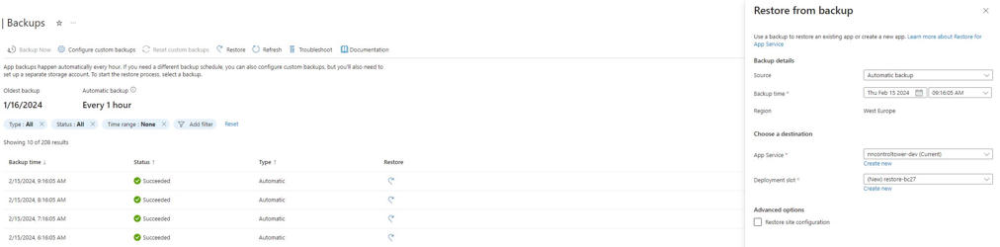

Current limitation:
- Microsoft Azure currently returns an error in deployment process when attempting restore.
- Web App backups can currently be stored, but not restored.

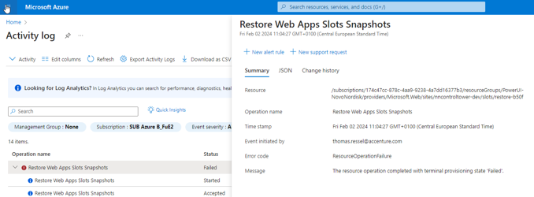

## Power UI Update with Downtime

For production systems, restrict App Service access during update to avoid user-facing errors.

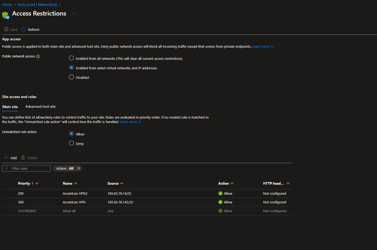

## Troubleshooting

### Restart failed SSH installation

If installation fails in Azure SSH (for example, dropped SSH session), retry as follows:

1. Go to `/home/site/wwwroot/powerui/releases`.
2. Delete the failed release:

```bash
rm -rf 2.13.24+20240626135018_NN_ControlTower_Azure_PROD
```

3. Return to `/home/site/wwwroot/` and rerun:

```bash
php -d memory_limit=2G 2.13.24+20240626135018_NN_ControlTower_Azure_PROD.phx
```

### Git Console: "Working Directory is not a folder!"

If Git Console cannot start after installation and shows this error, do:

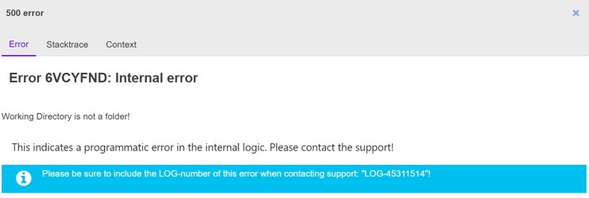

1. Open SSH console for the app.
2. Go to:
   - `home/site/wwwroot/powerui/releases/{name-of-a-previous-working-release}/vendor`
3. Copy app folder into current broken release:

```bash
cp -R {App-or-customer-folder-name} ../../{name-of-current-broken-release}/vendor/{App-or-customer-folder-name}
```

4. This copies the app from a known working release into the current release.

